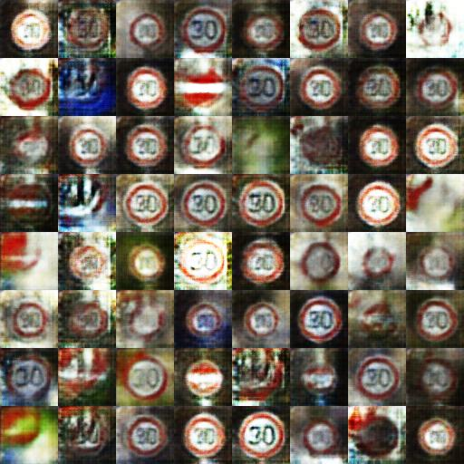
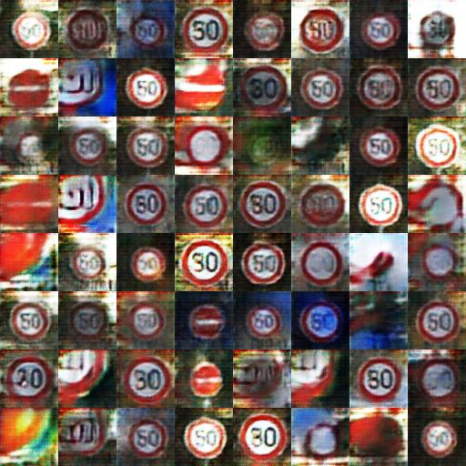
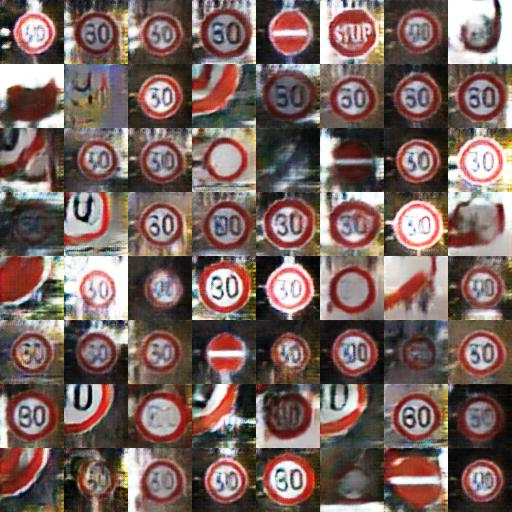
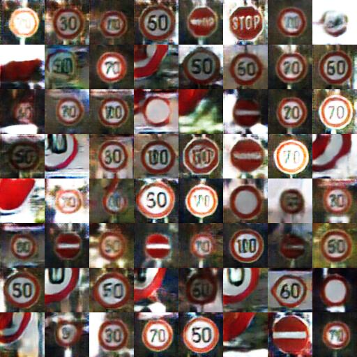

# Deep Convolutional GAN in Tensorflow for Traffic Sings

DCGAN Tensorflow implementation of [Deep Convolutional Generative Adversarial Networks](http://arxiv.org/abs/1511.06434) was done by [Kim Taehoon](https://github.com/carpedm20). Also the huge part of this README is copied from his repo.

* [Brandon Amos](http://bamos.github.io/) wrote an excellent [blog post](http://bamos.github.io/2016/08/09/deep-completion/) and [image completion code](https://github.com/bamos/dcgan-completion.tensorflow) based on this repo.
* *To avoid the fast convergence of D (discriminator) network, G (generator) network is updated twice for each D network update, which differs from original paper.*

## Prerequisites

- Python 2.7 or Python 3.3+
- [Tensorflow 0.12.1](https://github.com/tensorflow/tensorflow/tree/r0.12)
- [SciPy](http://www.scipy.org/install.html)
- [pillow](https://github.com/python-pillow/Pillow)
- (Optional) [moviepy](https://github.com/Zulko/moviepy) (for visualization)
- (I faced issue while using 1.16.0, so I rolled back to 1.15.4)[NumPy] 

## Dataset

To training purposes I compiled 3 datasets (TSRD (I suppose with Japanies signs), Belgium-TSC, German-GTSRB) and extracted only speed limit signs with various numbers, stop sign, road closed, no entry for vehicular traffic.

## Usage

To train a model with downloaded dataset:

    $ python main.py --dataset DATASET_NAME --input_height=28 --output_height=28 --train
    or
    $ python main.py --dataset DATASET_NAME --input_height=108 --train --crop

To test with an existing model:

    $ python main.py --dataset DATASET_NAME --input_height=28 --output_height=28
    or
    $ python main.py --dataset DATASET_NAME --input_height=108 --crop  

## Results
Progress of training

Basic dataset             |  Blue Cirle dataset | Blue Circle with preprocessing 
:--------------------:|:--------------------:|:--------------------:
  |   | 

### Generated Signs

Basic dataset             |  Blue Cirle dataset | Blue Circle with preprocessing 
:--------------------:|:--------------------:|:--------------------:
  |   | 

After 6th epoch:

After 10th epoch:

After 17th epoch:

After 24th epoch:

## TODO:

[DONE] Remove mnist related code
1) Preprocessing of dataset: apply auto crop and [DONE] brightness/contrast adjustment
2) Play around with networks architecture
3) Add traffic sign classifier and compare result on "real" signes and DCGAN-generated

## Author

Aleksander Lukashou / [@va9abund](https://github.com/va9abund/)
with reference to [@carpedm20](http://carpedm20.github.io/)
